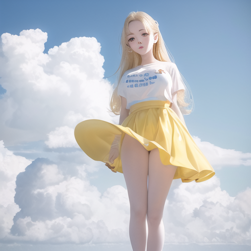

click ---> readme.md   For detail X VIEW

prompt : <lora:yaeMikoRealistic_yaemikoMixed:0.75>, (ulzzang-6500:0.66), (pureerosface_v1:0.9),masterpiece, best quality, highly detailed,(strong outfocus background  in sky:1.5),out door,sfw,(angel) in cloud,(white T-shirt,blond long hair),(naked feet),detailed face,(yellow long:1.2) skirt,well toned body

neg prompt : (worst quality, low quality:1.4), easynegative, bad_prompt_version2,bad anatomy

step : 20

width : 256
height : 256

upscale : 2x

plot x:hires upsclaer

plot y:sampler

Latent, Latent (antialiased), Latent (bicubic), Latent (bicubic antialiased), Latent (nearest), Latent (nearest-exact), None, Lanczos, Nearest, ESRGAN_4x, R-ESRGAN 4x+, R-ESRGAN 4x+ Anime6B, LDSR, SwinIR 4x

Euler a, Euler, LMS, Heun, DPM2, DPM2 a, DPM++ 2S a, DPM++ 2M, DPM++ SDE, DPM fast, DPM adaptive, LMS Karras, DPM2 Karras, DPM2 a Karras, DPM++ 2S a Karras, DPM++ 2M Karras, DPM++ SDE Karras, DDIM, PLMS

<table>
  <tr>
    <td>plot xy</td>
    <td>Euler a</td>
    <td>Euler</td>
    <td>LMS</td>
    <td>Heun</td>
   </tr>
  <tr>
    <td>Latent</td>
    <td></td>
    <td></td>
    <td></td>
    <td></td>
  </tr>
  <tr>
    <td>Latent (antialiased)</td>
    <td></td>
    <td></td>
    <td></td>
    <td></td>
  </tr>
  <tr>
    <td>Latent  (bicubic)</td>
    <td></td>
    <td></td>
    <td></td>
    <td></td>
  </tr>
  <tr>
    <td>Latent (bicubic  antialiased)</td>
    <td></td>
    <td></td>
    <td></td>
    <td></td>
  </tr>
  <tr>
    <td>Latent  (nearest)</td>
    <td></td>
    <td></td>
    <td></td>
    <td></td>
  </tr>
  <tr>
    <td> Latent (nearest-exact)</td>
    <td></td>
    <td></td>
    <td></td>
    <td></td>
  </tr>
  <tr>
    <td>None</td>
    <td></td>
    <td></td>
    <td></td>
    <td></td>
  </tr>
  <tr>
    <td>Lanczos</td>
    <td></td>
    <td></td>
    <td></td>
    <td></td>
  </tr>
<!-- Lanczos, Nearest, ESRGAN_4x, R-ESRGAN 4x+, R-ESRGAN 4x+ Anime6B, LDSR, SwinIR 4x --> 
  <tr>
    <td>Nearest</td>
    <td></td>
    <td></td>
    <td></td>
    <td></td>
  </tr>
  <tr>
    <td>ESRGAN_4x</td>
    <td></td>
    <td></td>
    <td></td>
    <td></td>
  </tr>
  <tr>
    <td>R-ESRGAN 4x+</td>
    <td></td>
    <td></td>
    <td></td>
    <td></td>
  </tr>
  <tr>
    <td>R-ESRGAN 4x+ Anime6B</td>
    <td></td>
    <td></td>
    <td></td>
    <td></td>
  </tr>
  <tr>
    <td>LDSR</td>
    <td></td>
    <td></td>
    <td></td>
    <td></td>
  </tr>
  <tr>
    <td>SwinIR 4x </td>
    <td></td>
    <td></td>
    <td></td>
    <td></td>
  </tr>

</table>

<!-- Euler a, Euler, LMS, Heun, DPM2, DPM2 a, DPM++ 2S a, DPM++ 2M, DPM++ SDE, DPM fast, DPM adaptive, LMS Karras, DPM2 Karras, DPM2 a Karras, DPM++ 2S a Karras, DPM++ 2M Karras, DPM++ SDE Karras, DDIM, PLMS
-->
<table>
  <tr>
    <td>DPM2</td>
    <td> DPM2 a</td>
    <td>DPM++ 2S a</td>
    <td> DPM++ 2M</td>
    <td>DPM++ SDE</td>
   </tr>
  <tr>
    <td>Latent</td>
    <td></td>
    <td></td>
    <td></td>
    <td></td>
  </tr>
  <tr>
    <td>Latent (antialiased)</td>
    <td></td>
    <td></td>
    <td></td>
    <td></td>
  </tr>
  <tr>
    <td>Latent  (bicubic)</td>
    <td></td>
    <td></td>
    <td></td>
    <td></td>
  </tr>
  <tr>
    <td>Latent (bicubic  antialiased)</td>
    <td></td>
    <td></td>
    <td></td>
    <td></td>
  </tr>
  <tr>
    <td>Latent  (nearest)</td>
    <td></td>
    <td></td>
    <td></td>
    <td></td>
  </tr>
  <tr>
    <td> Latent (nearest-exact)</td>
    <td></td>
    <td></td>
    <td></td>
    <td></td>
  </tr>
  <tr>
    <td>None</td>
    <td></td>
    <td></td>
    <td></td>
    <td></td>
  </tr>
  <tr>
    <td>Lanczos</td>
    <td></td>
    <td></td>
    <td></td>
    <td></td>
  </tr>
<!-- Lanczos, Nearest, ESRGAN_4x, R-ESRGAN 4x+, R-ESRGAN 4x+ Anime6B, LDSR, SwinIR 4x --> 
  <tr>
    <td>Nearest</td>
    <td></td>
    <td></td>
    <td></td>
    <td></td>
  </tr>
  <tr>
    <td>ESRGAN_4x</td>
    <td></td>
    <td></td>
    <td></td>
    <td></td>
  </tr>
  <tr>
    <td>R-ESRGAN 4x+</td>
    <td></td>
    <td></td>
    <td></td>
    <td></td>
  </tr>
  <tr>
    <td>R-ESRGAN 4x+ Anime6B</td>
    <td></td>
    <td></td>
    <td></td>
    <td></td>
  </tr>
  <tr>
    <td>LDSR</td>
    <td></td>
    <td></td>
    <td></td>
    <td></td>
  </tr>
  <tr>
    <td>SwinIR 4x </td>
    <td></td>
    <td></td>
    <td></td>
    <td></td>
  </tr>

</table>

